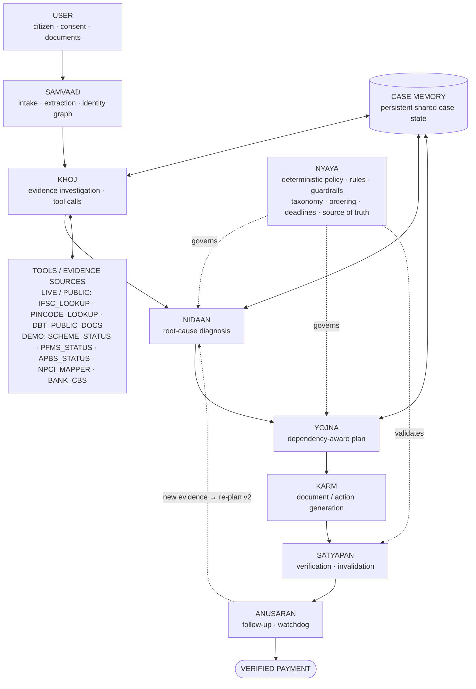

<div align="center">

# HAQ हक़ — The DBT Payment Recovery Agent

### <i>“Mera sarkari paisa kyun nahi aaya?”</i>

**“मेरे सरकारी पैसे क्यों नहीं आए?”**

HAQ is an **Agentic AI case-resolution system** for Direct Benefit Transfer (DBT) failures. It investigates failed or missing payments — pensions, scholarships, PM-KISAN and other welfare DBT flows — diagnoses the root cause **from evidence**, builds a dependency-aware resolution plan, generates office-ready action documents, verifies its own outputs, **re-plans when new evidence changes the case**, and maintains follow-up until payment is verified. Not a chatbot, not an FAQ bot, not a status checker — a **stateful agentic case-resolution workflow**.

<br/>


<br/><br/>

**<a href="https://github.com/harshtakalkar037-boop/HAQ-DBT-Recovery-Agent">GitHub</a>** &nbsp;·&nbsp;
**[Live Demo](https://haq-azure.vercel.app/)** &nbsp;·&nbsp;
**[API Docs](https://haq-azure.vercel.app/docs)** &nbsp;·&nbsp;
**[Pitch Deck — View / Download](docs/pitch_deck/HAQ-Pitch-Deck-Bharat-Agentic-2026.pptx)**

**[Website Screenshots — View](docs/website_screenshots/README.md)** &nbsp;·&nbsp;
**[Demo Folder](demo/README.md)** &nbsp;·&nbsp; **[Demo Video — coming soon]**

<br/>

**Bharat Agentic 2026** &nbsp;·&nbsp; **GovTech / Citizen Services**

</div>

---

**Sections:** [The Problem](#the-problem) · [The Gap](#the-gap) · [What HAQ Does](#what-haq-does) · [Why HAQ is not a chatbot](#why-haq-is-not-a-chatbot) · [Golden Demo](#golden-demo) · [Architecture](#architecture) · [Technical Stack](#technical-stack) · [Hosted Agent API](#hosted-agent-api) · [Source Transparency](#source-transparency) · [Privacy & Security](#privacy--security) · [Repository Structure](#repository-structure) · [Quick Start](#quick-start)

---

## The Problem

> **“The money was released. So why didn't it arrive?”**

A Direct Benefit Transfer crosses **six institutions** before it reaches the beneficiary:

```
Government Scheme  →  PFMS / Treasury  →  APBS  →  NPCI Mapper  →  Bank  →  Beneficiary
```

When a payment fails, no single institution owns the case. The citizen is left holding **fragmented evidence** from a scheme portal, a treasury system, a payment bridge, a mapper, a bank branch and a local office — and has to figure out *where* the pipeline broke, *why*, and *what to do next*.

HAQ's deterministic failure taxonomy covers documented categories such as:

- **Name mismatch** — beneficiary name inconsistent across Aadhaar, bank and scheme records (e.g. NPCI B06 class failures)
- **Inactive / dormant account** — mapped account not in an operable credit state
- **Aadhaar / DBT mapping problems** — Aadhaar not seeded, not enabled for DBT, or mapped to the wrong account
- **Payment rejection** — installment released but returned/rejected downstream (e.g. APBS return codes)
- **eKYC / life-certificate issues** — pending eKYC, missing life certificate for pension continuity
- **Account validation failure** — PFMS/agency-side account validation errors
- **Other configured failure taxonomy cases** — extensible taxonomy entries in `backend/rules/taxonomy.json`

---

## The Gap

| Existing option | What it does | What is missing |
|---|---|---|
| Status portals | Shows status | Doesn't diagnose or fix |
| Helplines | Answers questions | Doesn't maintain the case |
| CSC / agents | Helps with forms | Doesn't own the full workflow |
| Bank | Sees bank-side state | Doesn't coordinate the whole chain |
| Department | Sees scheme-side state | Doesn't see the full banking side |
| Blogs / videos | Explain possibilities | Don't reason over the user's evidence |

> **The missing layer is an owner of the entire failure-to-resolution workflow.**

---

## What HAQ Does

```
CITIZEN INPUT
     ↓
  SAMVAAD
     ↓
   KHOJ
     ↓
  NIDAAN
     ↓
   YOJNA
     ↓
   KARM
     ↓
 SATYAPAN
     ↓
  ANUSARAN
     ↓
VERIFIED RESOLUTION
```

**SAMVAAD** — Intake & extraction
- Intake of the citizen's complaint in natural language
- Multilingual / Hinglish understanding
- Document parsing (Aadhaar, passbook, SMS, scheme letters)
- Structured case file with a full **identity graph**
- Cross-field **mismatch detection** — extraction is never blindly trusted

**KHOJ** — Evidence investigation
- Evidence gathering across the payment chain
- Payment-chain evidence assembly (scheme → PFMS → APBS → NPCI → bank)
- Public tool lookups (IFSC, pincode, DBT knowledge)
- Every result is **source-labelled** (LIVE / PUBLIC / DEMO, timestamp, confidence)

**NIDAAN** — Root-cause diagnosis
- Deterministic failure taxonomy (the LLM never invents government rules)
- Root-cause diagnosis with supporting **evidence + confidence**
- Evidence-first scoring across all documents
- **Override rules** when material evidence changes the case

**YOJNA** — Action planning
- Dependency-aware planning
- Step ordering with owners, deadlines and completion conditions
- Plan ownership tracked against case state
- Visible **PLAN v1 → PLAN v2** re-planning

**KARM** — Document / action generation
- Fixed document templates only — no free-form legal drafting
- Action letters
- Grievance drafts (CPGRAMS and department channels)
- Bank-counter scripts
- Structured document generation with validated fields (Preview → Verify → Download)

**NYAYA** — Deterministic policy / rules layer
- Deterministic policy and rules for all critical decisions
- Ordering constraints (e.g. name correction before re-seeding)
- Deadlines and escalation ladders
- Guardrails that can **block** an unsafe step and say exactly why
- The **source of truth** for taxonomy, policy and document correctness

**SATYAPAN** — Evidence verification
- Verifies generated artifacts before they are used
- Checks populated fields
- Checks identity consistency across the case
- Checks plan version on every artifact
- **Invalidates outdated artifacts** when the plan changes
- Detects **material change** and triggers re-planning

**ANUSARAN** — Follow-up & escalation
- Follow-up timeline with deadlines
- Escalation ladder (departmental → grievance → RTI)
- Watchdog state that keeps ticking
- The **case stays open until payment is verified**

---

## Why HAQ is not a chatbot

Traditional AI:

```
Question → Answer → Done
```

HAQ:

```
Evidence → Investigate → Diagnose → Plan → Act → Verify
   → New evidence → Re-plan → Follow up → Resolve
```

What makes HAQ genuinely **agentic**:

1. **Stateful workflow** — case state is persisted in SQLite locally and can be reopened and continued in the same application runtime
2. **Multiple specialized agents** — SAMVAAD, KHOJ, NIDAAN, YOJNA, KARM, SATYAPAN, ANUSARAN with distinct responsibilities
3. **Tool use** — real tool calls to public directories and institutional adapters, visible in a tool-trace board
4. **Structured case state** — agents exchange structured state (case files, evidence, diagnoses, plans), not chat messages
5. **Multi-step planning** — dependency-ordered action plans with owners, deadlines and completion conditions
6. **Verification** — SATYAPAN verifies every generated artifact and the evidence behind it
7. **Autonomous re-planning** — new evidence invalidates assumptions, changes the diagnosis and produces **PLAN v2** without being asked twice
8. **Follow-up / watchdog** — ANUSARAN maintains deadlines and escalates when the system goes quiet
9. **Explicit closing condition** — a defined, testable definition of "done"

> **A case is not considered resolved merely because a document was generated. HAQ closes the case only when payment is verified.**

---

## Golden Demo

*The clearest demonstration of agentic re-planning — one case, two plans, one changing reality.*

### Scenario

| | |
|---|---|
| **Citizen** | Shantabai Pawar |
| **Age** | 67 |
| **Location** | Nashik, Maharashtra |
| **Scheme** | Old Age Pension |
| **Complaint** | Pension stopped for 3 months |

### Initial evidence

| Evidence node | Reported status |
|---|---|
| Scheme portal | Released |
| PFMS / Treasury | Processed |
| APBS | Returned (reject code 25) |
| NPCI Mapper | Inactive |
| Bank CBS | Reports "account closed" |
| Name (Aadhaar vs bank) | Mismatch — `SHANTA BAI DAGDU PAWAR` vs `SHANTABAI D. PAWAR` (B06 class) |

### Diagnosis (NIDAAN)

```
ROOT       : CLOSED_MAPPED_ACCOUNT   (confidence 0.80)
SECONDARY  : NAME_MISMATCH
WATCH ITEM : life certificate (deadline 30 Nov)
```

Every conclusion carries cited evidence, taxonomy signals and the exact rules used.

### PLAN v1 (YOJNA)

```
Correct account / mapping
   → gather documents
   → bank / NPCI actions
   → follow-up / verification
```

YOJNA expands these phases into **9 dependency-ordered steps** with owners and deadlines. NYAYA **blocks** the re-seeding step with a visible `NYAYA BLOCK` badge — *name correction must come first (B06)*. The rules engine, not the LLM, makes that call.

### The agentic moment — NEW PASSBOOK EVIDENCE

A second passbook page is submitted showing **recent account activity**.

The account is not closed. **It is dormant.**

```
CLOSED_MAPPED_ACCOUNT  →  DORMANT_MAPPED_ACCOUNT
```

The case is not patched — it is **re-planned**:

```diff
  Diagnosis : CLOSED_MAPPED_ACCOUNT  →  DORMANT_MAPPED_ACCOUNT
+ REACTIVATE_DORMANT_ACCOUNT
- OLD_ACCOUNT_ACTION   (removed)
```

Then, automatically:

- Old assumptions and **9 outdated documents are invalidated** (SATYAPAN)
- **New action documents are generated** against PLAN v2 (KARM)
- **Watchdog remains active** and the follow-up continues from the new state (ANUSARAN)

> **HAQ doesn't blindly execute an old plan. It re-plans when the evidence changes.**

---

## Architecture



- **Agents exchange structured state rather than chat messages** — identity graphs, evidence chains, diagnoses, plan objects, verification reports.
- **The orchestrator routes the case and records structured case events** — every tool call, decision and state change is an inspectable event in the case log (visible live in the app's Agent Activity / Tool-Trace board).
- **NYAYA** is the deterministic policy / rules / guardrail layer — the source of truth for critical decisions.
- **CASE MEMORY** is the shared case state stored in SQLite. In the local application it can be reopened and continued; the Vercel prototype uses temporary runtime storage and should not be treated as permanent production persistence.

---

## Technical Stack

| Layer | Current implementation |
|---|---|
| Frontend | HTML, CSS, JavaScript |
| Backend | Python, FastAPI, Uvicorn |
| Orchestration | Stateful agent orchestrator |
| Rules | Deterministic JSON rules / NYAYA |
| Data | SQLite + JSON knowledge/rules |
| Public integrations | Public IFSC directory, public postal pincode directory, DBT public knowledge |
| Institutional adapters | DEMO: Scheme Status, PFMS Status, APBS Status, NPCI Mapper, Bank CBS |
| Optional language layer | Groq / Gemini when configured; deployed demo uses a deterministic language layer |

---

## Hosted Agent API

HAQ exposes a hosted FastAPI endpoint for external integrations and the aiKart submission flow.

**Endpoint**

```text
POST https://haq-azure.vercel.app/api/aikart/run
```

**Request**

```json
{
  "message": "My old age pension has not been credited for 3 months.",
  "language": "hi-en",
  "consent": true
}
```

**Response**

```json
{
  "success": true,
  "case_id": "HAQ-XXXXXXXX",
  "status": "WATCHDOG",
  "diagnosis": "CLOSED_MAPPED_ACCOUNT",
  "secondary_diagnosis": "NAME_MISMATCH",
  "confidence": 0.8,
  "payment_status": "BLOCKED",
  "next_action": "Submit annual life certificate (Jeevan Pramaan) before the 30 November deadline",
  "agentic_workflow": [
    "SAMVAAD",
    "KHOJ",
    "NIDAAN",
    "YOJNA",
    "KARM",
    "NYAYA",
    "SATYAPAN",
    "ANUSARAN"
  ]
}
```

> The `case_id` is generated dynamically for each request. The diagnosis and next action are read from the resulting case state rather than hard-coded into the API response.

**Interactive API documentation:** https://haq-azure.vercel.app/docs

### Deployment note

The hackathon Vercel prototype uses temporary runtime storage for writable application data. SQLite is suitable for the prototype demonstration, but it should not be treated as permanent production storage across arbitrary serverless instances. A production deployment would use a durable external database.

---

## Source Transparency

Every result HAQ shows carries a **provenance label**: source · LIVE / PUBLIC / DEMO · timestamp · confidence. HAQ never presents a simulated call as a live one.

### LIVE / PUBLIC

**IFSC_LOOKUP**
Public IFSC directory lookup.
Real HTTP fetch when network is available.

**PINCODE_LOOKUP**
Public postal pincode directory service.
Real HTTP fetch when network is available.

**DBT_PUBLIC_DOCS**
Curated public DBT knowledge / document retrieval, with cited source URLs.

### DEMO

**SCHEME_STATUS** · **PFMS_STATUS** · **APBS_STATUS** · **NPCI_MAPPER** · **BANK_CBS**

Beneficiary-level institutional status normally requires authenticated / authorized access. For the hackathon MVP these are represented by realistic **DEMO adapters** behind the same tool interface (`GovTool` adapter contract), so the same workflow can later be pointed at authorized integrations without redesign.

> **Honesty rules baked in:** IFSC and pincode lookups are **third-party public directory services** — not RBI APIs, not India Post APIs, not government beneficiary databases. HAQ claims **no** live beneficiary-level PFMS / NPCI / APBS / bank access. If a live public lookup fails, HAQ marks the source **unavailable** and continues on the remaining evidence — it never fabricates a successful result.

---

## Privacy & Security

- **User consent** required before case processing
- **Aadhaar masking** in the UI (`XXXX XXXX 2109`)
- **Bank account masking** in the UI (`XXXX4521`)
- **Delete My Case** — permanent, user-triggered case deletion
- **Privacy Center** — in-product privacy disclosures and controls
- **Source transparency** — every result labelled with source, mode and timestamp
- **No secrets in frontend/logs** — language-layer keys are environment variables only
- **Synthetic demo data** — all seeded beneficiaries are fictional
- **No real Aadhaar / real financial information** anywhere in the demo

---

## Repository Structure

```
frontend/
├── index.html              # Case console UI
├── styles.css              # GovTech design system and accessibility modes
└── app.js                  # UI state, agent board, tool trace, i18n
backend/
├── main.py                # FastAPI app, REST API, consent gate, masking, case CRUD
├── orchestrator.py        # Stateful agent orchestration + structured case events
├── agents.py              # Specialized HAQ agents
├── extract.py             # Document extraction, identity graph, mismatch detection
├── adapters.py             # LIVE/PUBLIC tools + DEMO institutional adapters
├── core.py                # CaseStore, NYAYA rules engine, masking helpers
├── docs_templates.py      # KARM fixed action-document templates
├── seed.py                # Synthetic demo cases including the Shantabai golden case
├── rules/
│   ├── taxonomy.json      # Deterministic failure taxonomy + scoring signals
│   ├── policy.json        # Deadlines, escalation ladder, guardrails
│   └── playbooks.json     # Scheme playbooks with dependency-ordered steps
└── kb/
    └── dbt_knowledge.json # Curated public DBT guidance with cited source URLs
docs/
├── pitch_deck/
│   └── HAQ-Pitch-Deck-Bharat-Agentic-2026.pptx
└── website_screenshots/
    ├── README.md
    └── 01–07 project screenshots
app.py                     # Vercel entrypoint
vercel.json                # Vercel deployment configuration
requirements.txt
run.sh                     # Local app startup
README.md
```

---

## Quick Start

```bash
git clone https://github.com/harshtakalkar037-boop/HAQ-DBT-Recovery-Agent.git
cd HAQ-DBT-Recovery-Agent

python3 -m venv .venv
source .venv/bin/activate

pip install -r requirements.txt

chmod +x run.sh
./run.sh
```

Then open **http://localhost:8000** and click **▶ Run the Golden Demo** — the Shantabai Pawar pension case is seeded in the app and runs the full workflow, including the ⭐ re-planning moment.


---

<div align="center">

**HAQ हक़** — Bharat Agentic 2026 · GovTech / Citizen Services

© 2026 HAQ · Demo MVP with synthetic data

</div>
