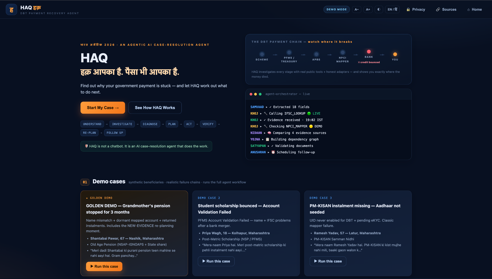
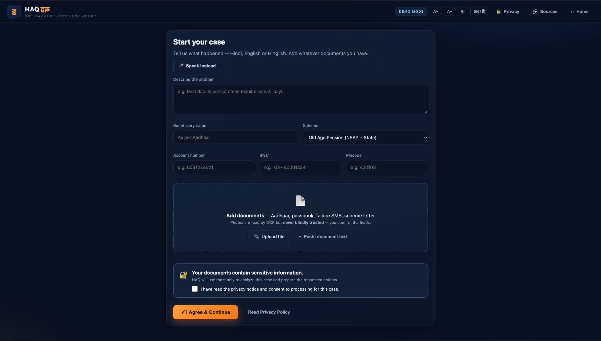
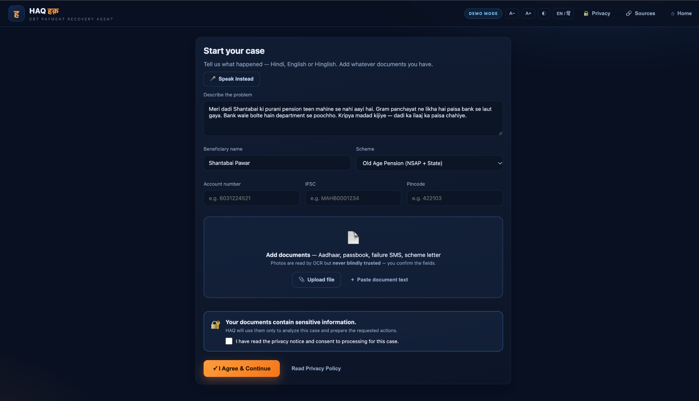
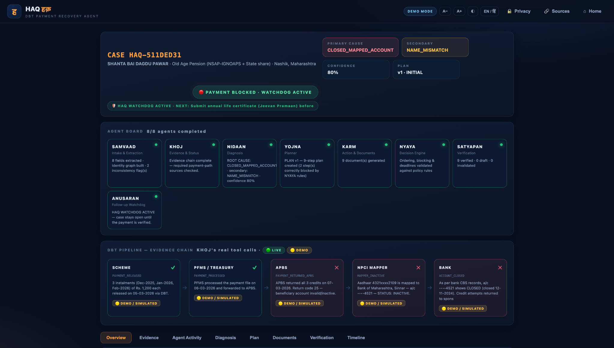
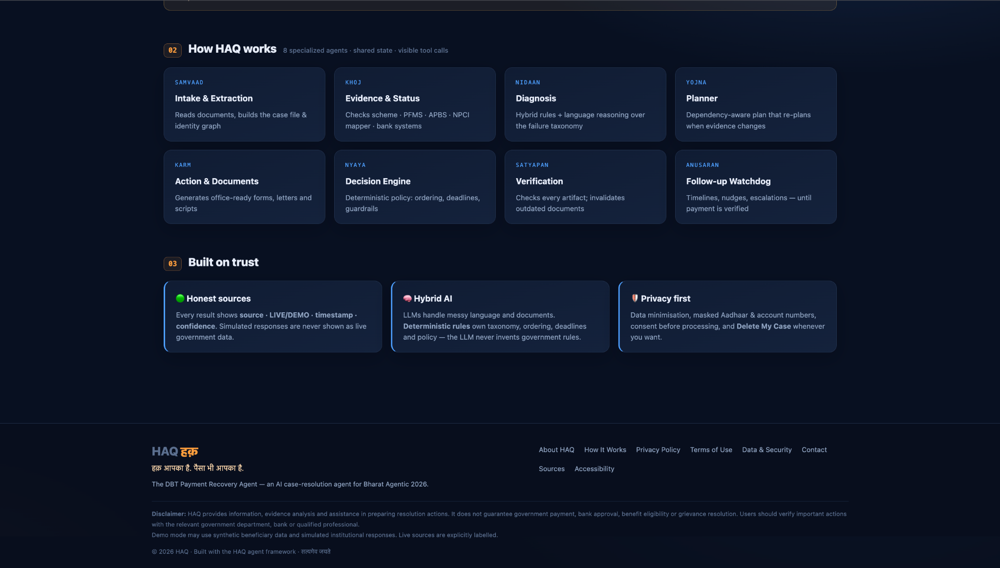
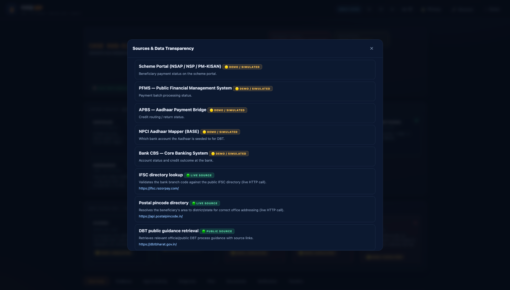
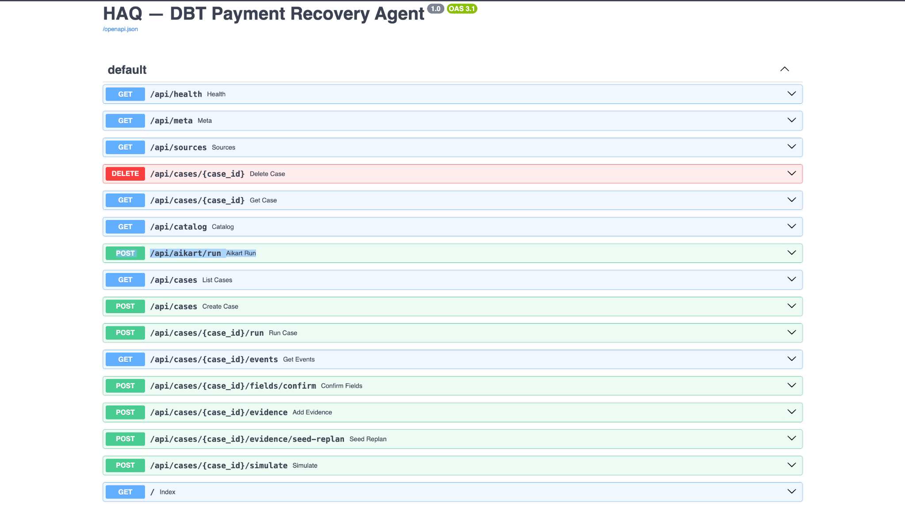

# HAQ Website Screenshots

Screenshots documenting the HAQ — DBT Payment Recovery Agent web application and its hosted API documentation.

## Screenshots

### 1. Home / Landing Page

Shows the HAQ value proposition, DBT payment-chain visualization, agent activity, and demo cases.

### 2. Case Intake

Shows the citizen case intake flow, language support, beneficiary details, document upload, and consent gate.

### 3. Filled Golden Demo Intake

Shows the Shantabai Pawar pension case being prepared for the Golden Demo workflow.

### 4. Case Overview

Shows the completed 8-agent workflow, diagnosis, evidence chain, payment status, and watchdog state.

### 5. How HAQ Works

Shows the eight specialized agents and the trust, source-transparency, hybrid-AI, and privacy principles.

### 6. Sources & Data Transparency

Shows which sources are demo/simulated, live public sources, and public DBT guidance.

### 7. Hosted API Documentation

Shows the FastAPI/OpenAPI documentation, including the hosted `POST /api/aikart/run` endpoint.

## Notes

- Screenshots document the project interface and demo workflow.
- Demo/simulated institutional sources are explicitly labelled in the application.
- No passwords, API keys, or private credentials are included.
